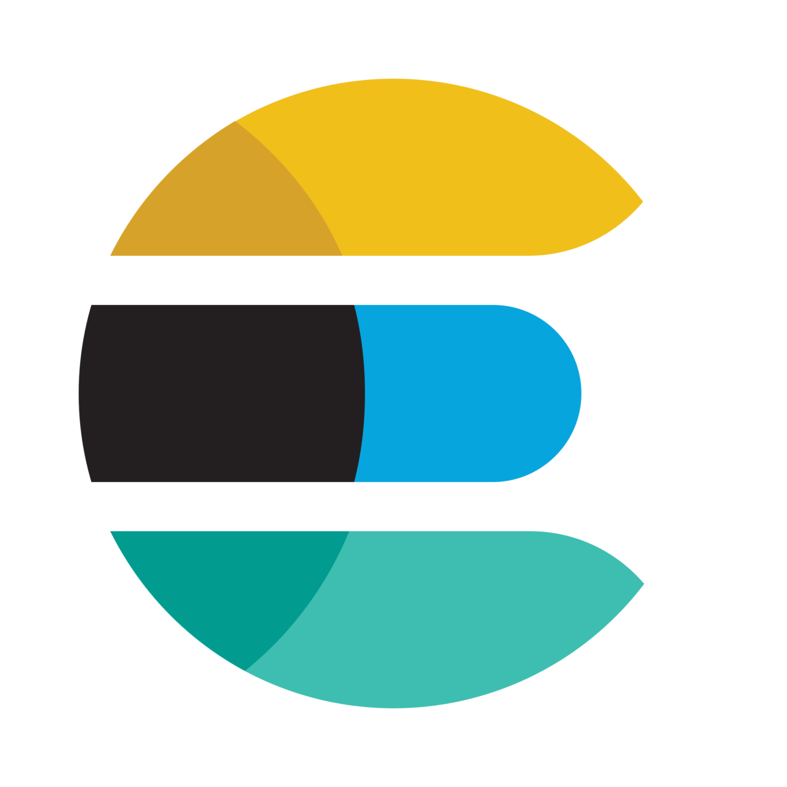
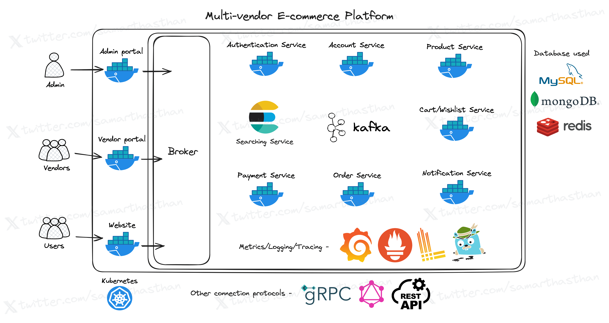

# Multi-Vendor E-commerce Platform

Welcome to the Multi-Vendor E-Commerce Platform project! This project aims to create a scalable, feature-rich e-commerce platform similar to Amazon and Flipkart. It includes an admin portal for managing the platform, a vendor portal for sellers, and a public website for customers.

### Project Status

This project is currently in its early stages and is being developed by a solo developer. Due to its complexity and scale, it is expected to take a considerable amount of time to complete. Contributions and feedback are welcome and appreciated.

## Technologies Used

## Project Overview

### High Level Design

This project is built using various technologies to ensure efficiency, scalability, and maintainability. Here's an overview of the key components:

- **Backend**: Developed in Golang, the backend consists of microservices built using gRPC, GraphQL, and RESTful APIs for seamless communication between different parts of the system.
- **Frontend**:
  - Admin Portal: Built with React.js, providing an intuitive interface for platform administrators to manage users, products, orders, and more.
  - Vendor Portal & Public Website: Utilizing Next.js for server-side rendering and enhanced performance, these portals offer unique experiences for vendors to manage their stores and for customers to browse and purchase products.
- **Containerization**: Docker is used for containerization, enabling easy deployment and scaling of microservices across different environments.
- **Monitoring and Logging**: Grafana, Loki, Prometheus, and Jaeger are integrated for monitoring, logging, and tracing, ensuring the system's health and performance can be easily monitored and analyzed.
- **Databases**: The project employs MySQL, MongoDB, and Redis for efficient data storage, retrieval, and caching.

## Getting Started

To get started with the project, follow these steps:

1. Clone the repository.
2. Install Docker and Docker Compose.
3. Run `docker-compose up` to start the services.
4. Access the respective portals and websites via the provided URLs.

For detailed setup instructions and additional information, please refer to the documentation in the `docs` directory.

## Contribution Guidelines

Contributions to the project are encouraged! Whether you're interested in adding new features, fixing bugs, or improving documentation, please feel free to submit pull requests. Make sure to follow the contribution guidelines outlined in `CONTRIBUTING.md`.

## Contact

If you have any questions, suggestions, or need further assistance, feel free to reach out:

- **Twitter**: [@samarthasthan](https://twitter.com/samarthasthan)
- **Email**: [samarthasthan27@gmail.com](mailto:samarthasthan27@gmail.com)
