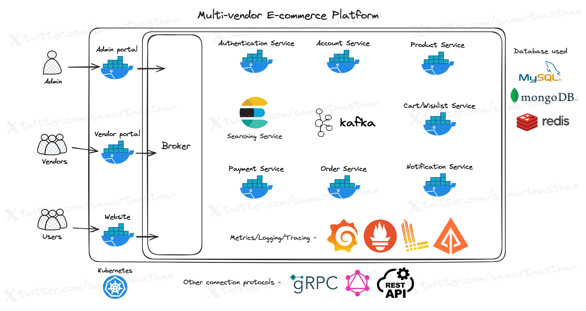

# Multi-Vendor E-commerce Platform

Welcome to the Multi-Vendor E-commerce Platform project! This project aims to create a scalable, feature-rich e-commerce platform, including an admin portal for managing the platform, a vendor portal for sellers, and a public website for customers.

## Currently Learning

I'm currently focusing on deepening my understanding of the Go `context` package, as well as channels and design patterns. These topics present some challenges in designing code and managing dependency injection, so any feedback and guidance on these aspects are particularly appreciated.

## Technologies Used

- **Backend**: Golang, gRPC, GraphQL, RESTful APIs.
- **Frontend**: React.js (Admin Portal), Next.js (Vendor Portal & Public Website).
- **Containerization**: Docker for easy deployment and scaling.
- **Databases**: MySQL, MongoDB, Redis.
- **Monitoring and Logging**: Grafana, Loki, Prometheus, Zipkin.
- **Messaging**: Kafka.

## Project Status

This project is in its early stages and is being developed by a junior developer in a learning phase. While I strive to be consistent at the beginning of the project, there may be times when my studies and other commitments affect my availability. Your patience and understanding are appreciated.

## Current Tasks and Next Steps

- **Authentication**: Implementing the authentication service logic.
  - Authentication and mail service are connected.
  - Authentication and broker are connected.
- **Frontend Development**: Creating the admin portal dashboard.
- **Logging and Monitoring**:
  - Implemented Loki and Prometheus.
  - Implemented Zipkins.

## High-Level Design

_High-level design of the multi-vendor e-commerce platform._

The project employs various technologies to ensure efficiency, scalability, and maintainability:

- **Microservices Architecture**: Utilizing Golang and modern frameworks for seamless communication across the platform.
- **Frontend Development**: React.js for the admin portal and Next.js for vendor portals and the public website.
- **Containerization**: Docker for efficient deployment and scaling of microservices.
- **Monitoring and Logging**: Grafana, Loki, Prometheus, and Jaeger for performance monitoring and analysis.
- **Data Storage and Caching**: MySQL, MongoDB, and Redis for efficient data handling.

## Monitoring and Logging Screenshot

_Monitoring and logging dashboard._

## Tracing Screenshot

_Tracing dashboard._

## Admin Dashboard Screenshot

_Admin portal dashboard._

## Getting Started

To get started with the project, follow these steps:

1. Clone the repository.
2. Install Docker and Docker Compose.
3. Run `docker-compose up` to start the services.
4. Access the respective portals and websites via the provided URLs.

For detailed setup instructions, please refer to the documentation in the `docs` directory.

## Port Configuration

Here's a list of ports used by the project:

| Name                 | Port  |
| -------------------- | ----- |
| Admin Portal         | 3000  |
| Vendor Portal        | 3001  |
| Website              | 3002  |
| Broker               | 7000  |
| Broker-GraphQL       | 7000  |
| Authentication       | 8000  |
| Authentication-MySql | 8001  |
| Authentication-Redis | 8002  |
| Account              | 9000  |
| Account-MongoDB      | 9001  |
| Product              | 10000 |
| Cart/Wishlist        | 11000 |
| Notification         | 12000 |
| Order                | 13000 |
| Payment              | 14000 |
| Grafana Dashboard    | 15000 |
| Grafana Loki         | 15001 |
| Prometheus           | 15002 |
| Jaeger               | 15003 |

## Contribution Guidelines

Contributions to the project are encouraged! Whether you're interested in adding new features, fixing bugs, or improving documentation, please submit pull requests. Follow the contribution guidelines outlined in `CONTRIBUTING.md`.

## Contact

For any questions, suggestions, or further assistance, feel free to reach out:

- **Twitter**: [@samarthasthan](https://twitter.com/samarthasthan)
- **Email**: [samarthasthan27@gmail.com](mailto:samarthasthan27@gmail.com)
